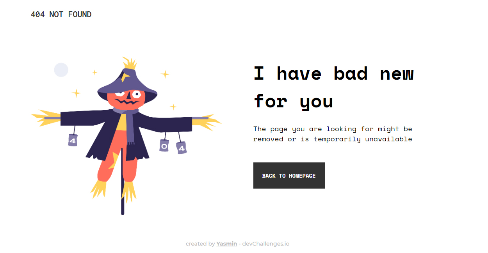
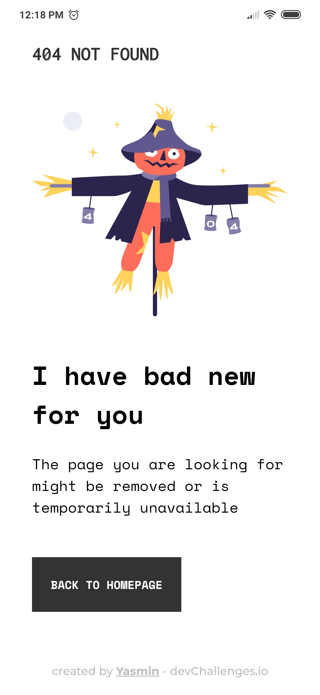

<h1 align="center">404 NOT FOUND</h1>

    <a href="#sobre">Sobre</a>
    |
    <a href="#demo">Demo</a>
    |
    <a href="#layout">Layout</a>

Esse projeto é a criação de uma página 404 Not Found e, foi realizado apenas com HTML e CSS.

---

 ## 🔮 demo

  <table>
  <tr>
      <td>desktop demo</td>
      <td>mobile demo</td>
    </tr>
    <tr>
      <td></td>
      <td></td>
    </tr>
  </table>

---

## 🔖 layout
Para acessar o layout, você precisa de uma conta no [devChallenges](https://devchallenges.io).
 
Acesse o desafio no link abaixo:
* [Desafio](https://devchallenges.io/challenges/wBunSb7FPrIepJZAg0sY)

---

✨ coded by Yasmin ✨
